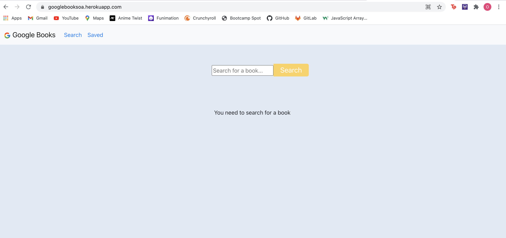
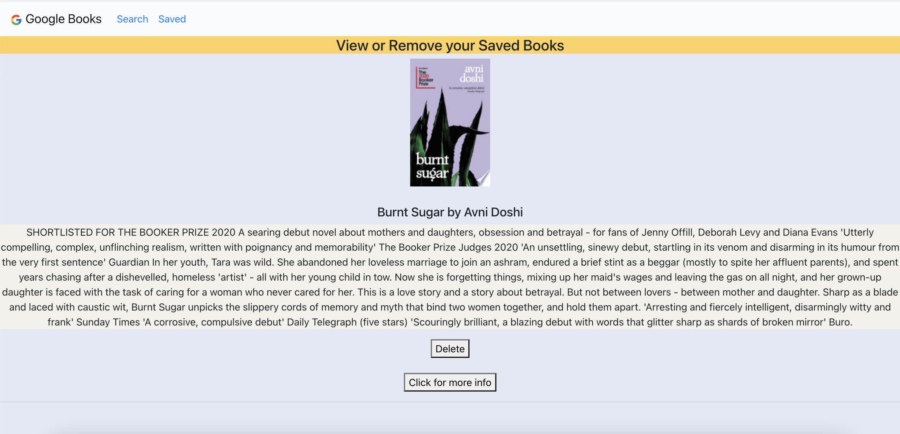

# Google Books Search

### What it does:

- Workout Tracker is React-based Google Books Search application.

- Users are able to search for any books using the Google Books API.

- They are also able to save books and view them on the 'Saved' Page.

- Users can 'Delete' or click the information button to purchase the book.

- All books are stored in a MongoDB database.

## Technology Used

- React/ Javascript

- Node.js / Express

- MongoDB / Atlas

- Mongoose

- Google Books API

- package.JSON

- gitignore

## Links

- [GitHub repository](https://github.com/omaymaahmad/week-21-google-books)

- [Heroku Deployed Link](https://googlebooksoa.herokuapp.com/)

- [My GitHub](https://github.com/omaymaahmad)

- My Email: <omayma.ahmad25@gmail.com>

## Screenshot of Application

